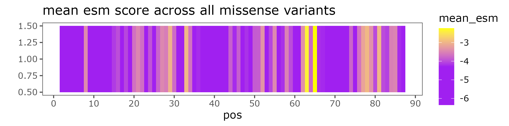
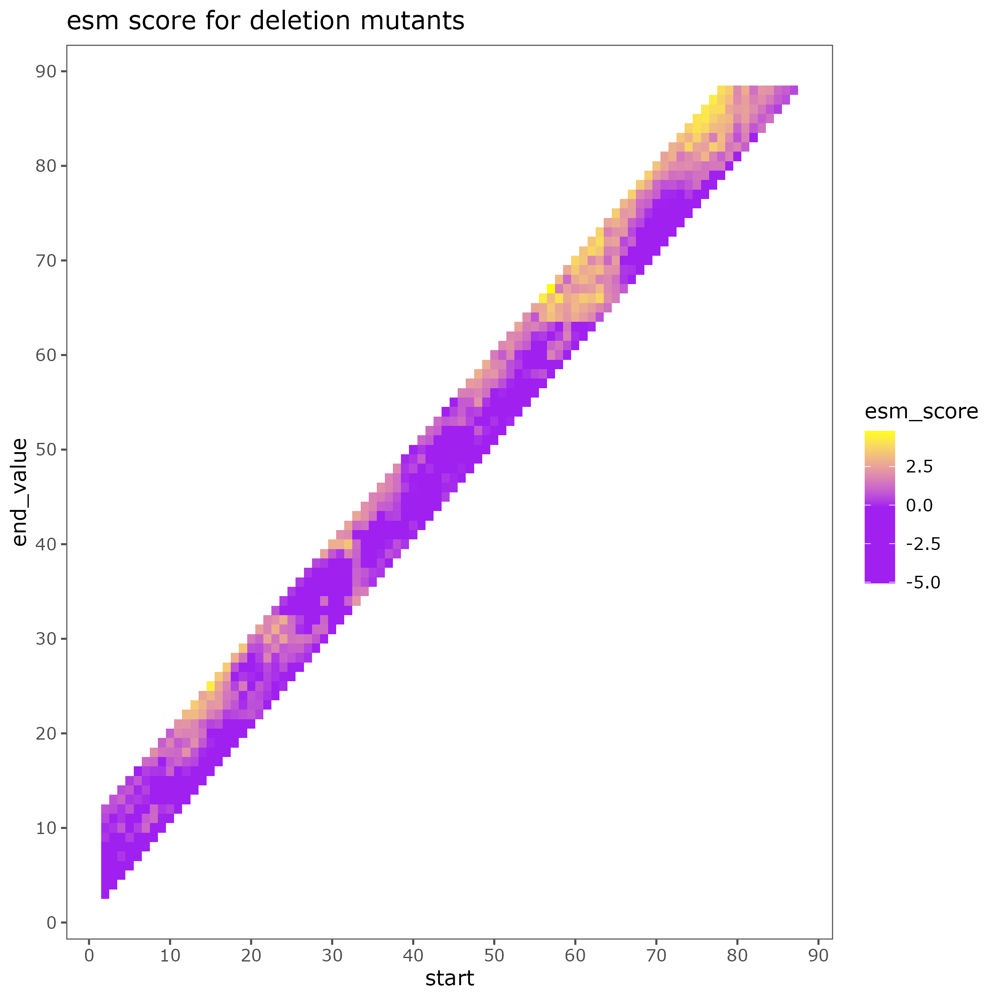

# AcrIIA4 mutant predictions with ESM1b


# Install requirements for variant prediction
```bash
pip3 install --user tqdm numpy pandas biopython torch fair-esm
git clone https://github.com/ntranoslab/esm-variants.git
```

# Prepare multiple-site deletion file
Requires a three-column file with `wt_seq`, `mut_seq`, `start_pos`.
Input built with [`build-muts.py`](build-muts.py)
```bash
python3 build-muts.py > muts.csv
```

# Run the models
```bash
bash esm-deletions.sh
bash esm-missense.sh
```

# Plot results

Plots generated with [`plot-variants.R`](plot-variants.R)


