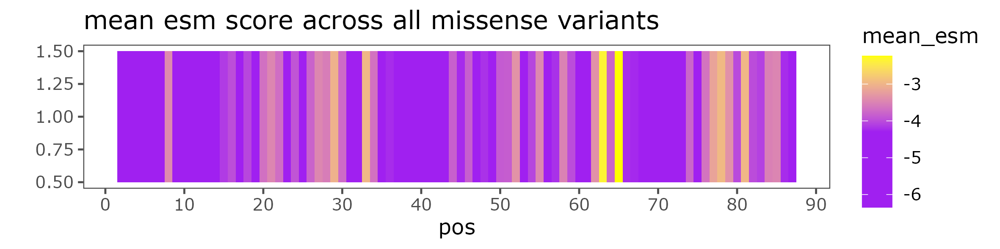
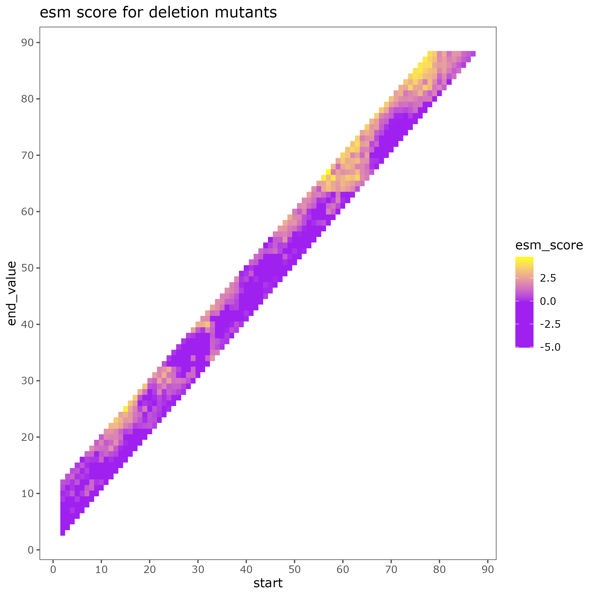

# AcrIIA4-INDELi-E

https://github.com/lehner-lab/deep_indel_mutagenesis/tree/main/single_protein_prediction


Download pretrained models
```bash
mkdir -p models
wget -P models/ https://github.com/lehner-lab/deep_indel_mutagenesis/edit/main/single_protein_prediction/INDELiE_deletions_model_pretrained.RData
wget -p models/ https://github.com/lehner-lab/deep_indel_mutagenesis/edit/main/single_protein_prediction/INDELiE_insertions_model_pretrained.RData
```

Download R functions from [lehner-lab github](https://github.com/lehner-lab/deep_indel_mutagenesis/tree/main/single_protein_prediction/Functions) and place in [`scripts`](scripts)


## Get 

See [`PyMOL on Biowulf`](https://hpc.nih.gov/apps/PyMOL.html)


```python
python predict.py \
    --model-location esm1v_t33_650M_UR90S_1 esm1v_t33_650M_UR90S_2 esm1v_t33_650M_UR90S_3 esm1v_t33_650M_UR90S_4 esm1v_t33_650M_UR90S_5 \
    --sequence HPETLVKVKDAEDQLGARVGYIELDLNSGKILESFRPEERFPMMSTFKVLLCGAVLSRVDAGQEQLGRRIHYSQNDLVEYSPVTEKHLTDGMTVRELCSAAITMSDNTAANLLLTTIGGPKELTAFLHNMGDHVTRLDRWEPELNEAIPNDERDTTMPAAMATTLRKLLTGELLTLASRQQLIDWMEADKVAGPLLRSALPAGWFIADKSGAGERGSRGIIAALGPDGKPSRIVVIYTTGSQATMDERNRQIAEIGASLIKHW \
    --dms-input ./data/BLAT_ECOLX_Ranganathan2015.csv \
    --mutation-col mutant \
    --dms-output ./data/BLAT_ECOLX_Ranganathan2015_labeled.csv \
    --offset-idx 24 \
    --scoring-strategy wt-marginals
```

Prep peptide fasta
```bash
echo '>AcrIIa4' > AcrIIa4.fa
echo 'MNINDLIREIKNKDYTVKLSGTDSNSITQLIIRVNNDGNEYVISESENES
IVEKFISAFKNGWNQEYEDEEEFYNDMQTITLKSELN' >> AcrIIa4.fa
```

# Install requirements for variant prediction
```bash
pip3 install --user tqdm numpy pandas biopython torch fair-esm
git clone https://github.com/ntranoslab/esm-variants.git
```


# Prepare multiple-site deletion file
Requires a three-column file with `wt_seq`, `mut_seq`, `start_pos`.
Input built with [`build-muts.py`](build-muts.py)
```bash
python3 build-muts.py > muts.csv
```

# Run the models

```bash
sbatch esm-deletions.sh     # Needs GPU
bash esm-missense.sh   # Fast enough without GPU
```

# Plot results

Plots generated with [`plot-variants.R`](plot-variants.R)


